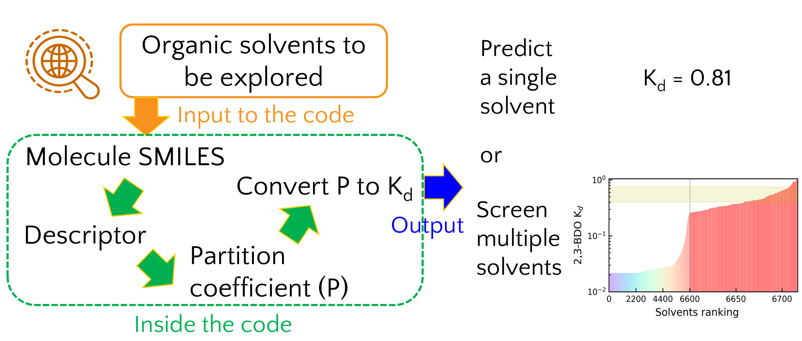

# LEAPS

LEAPS: Liquid–Liquid Extraction Adaptive Predictor and Screener for biomass separation

This project aims to develop fast-screening tools for identifying solvent candidates in the liquid-liquid extraction of biomass.

Current biomass compounds:

1. Diol: 2,3-butanediol (2,3-BDO). Publication: Ind. Eng. Chem. Res. 2025, 64, 32, 15790–15799 (https://doi.org/10.1021/acs.iecr.5c01569)
          
   Code_ML_screening.ipynb: Codes containing data processing, ML parameterization, solvent screening, and visualization

   CSV files: The DFT comptuted data and experimental data for validation.

   JSON and PKL files: The parameterized model and parameters ready for prediction

2. Long-chain fatty acid: under investigation.

This project is supported by U.S. Department of Energy, Bioenergy Technologies Office (BETO), via the Bioprocessing Separation Consortium. 
